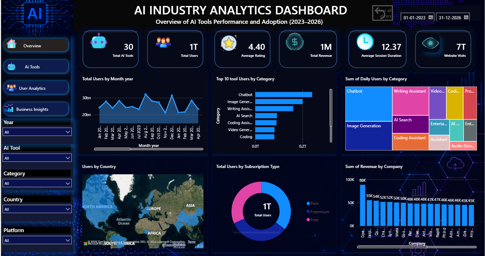
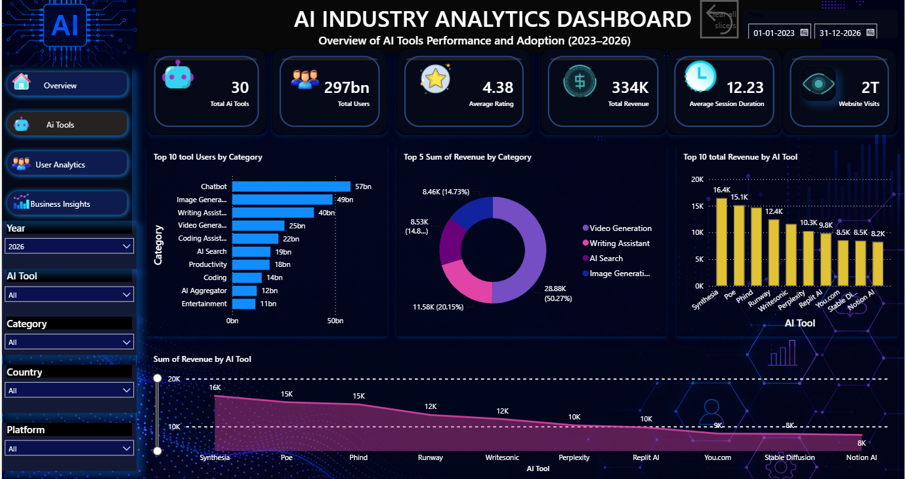
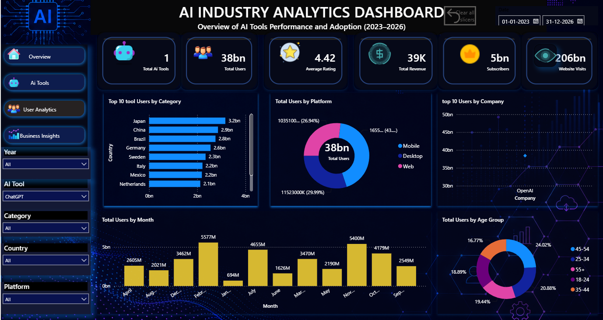
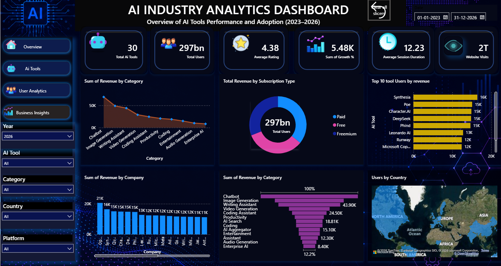

# AI Industry Analytics Dashboard

An interactive Power BI report for exploring AI tool performance and adoption from 2023 to 2026. Its overview page brings together headline metrics, usage trends, category and country comparisons, subscription mix, and company revenue.

  

  
  
  

## Dashboard pages

- **Overview** — total AI tools, users, average rating, revenue, average session duration, and website visits, alongside monthly user trends and category, country, subscription, and company breakdowns.
- **AI Tools** — compare tools and categories by user counts, ratings, and revenue.
- **User Analytics** — explore audience and usage patterns.
- **Business Insights** — review revenue and adoption trends.

Use the report filters to explore the data by date, year, AI tool, category, country, and platform.

## Project files

- `powerbi_ai_dashboard_updated4540.pbix` — Power BI report. Open this file with Power BI Desktop.
- `powerbi_project4540_updated4540.xlsx` — workbook used with the project.
- `powerbi_project_recording.mp4` — project recording.

## Open the report

1. Install [Power BI Desktop](https://powerbi.microsoft.com/desktop/).
2. Download or clone this repository.
3. Open `powerbi_ai_dashboard_updated4540.pbix` in Power BI Desktop.

If Power BI prompts for a data source, follow the prompt to locate or reconnect the workbook as needed.
